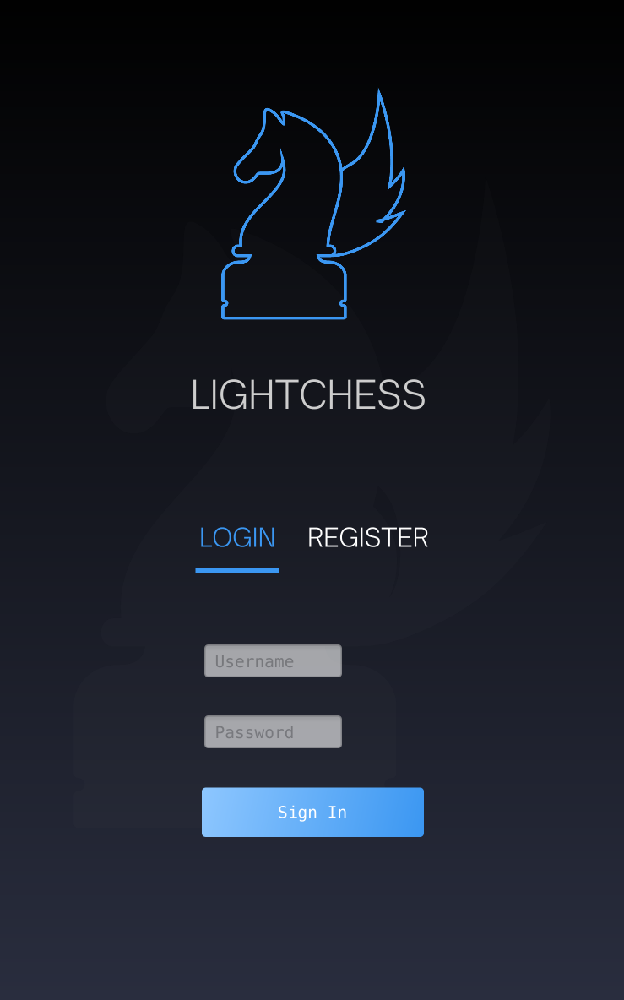
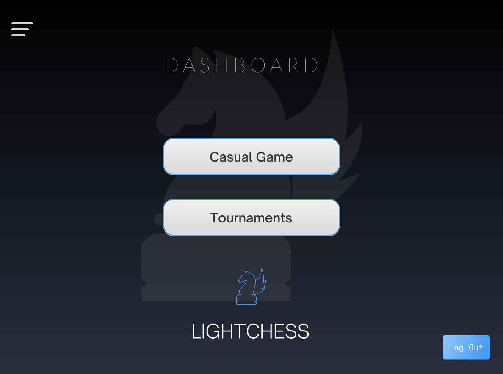
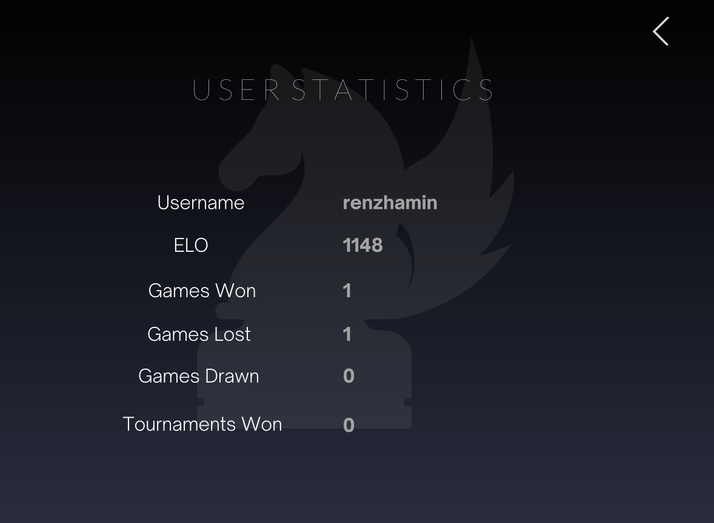
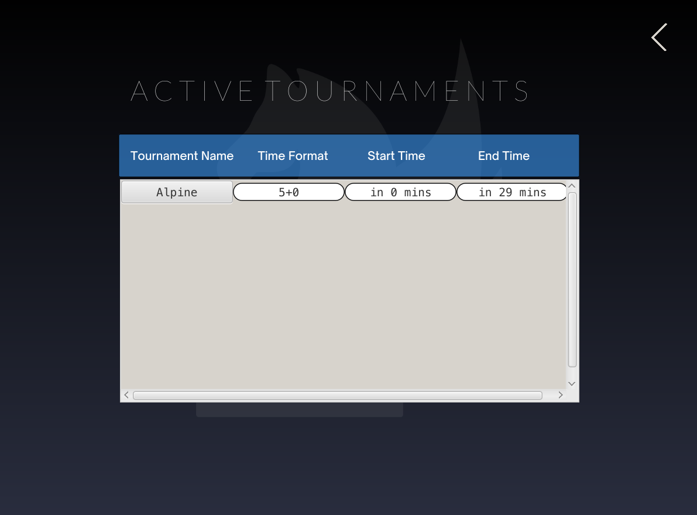
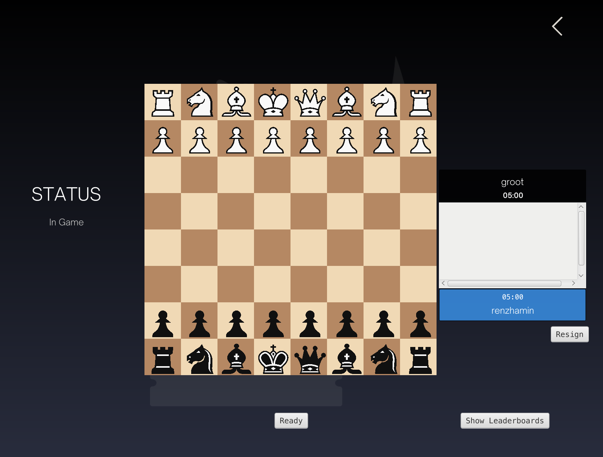
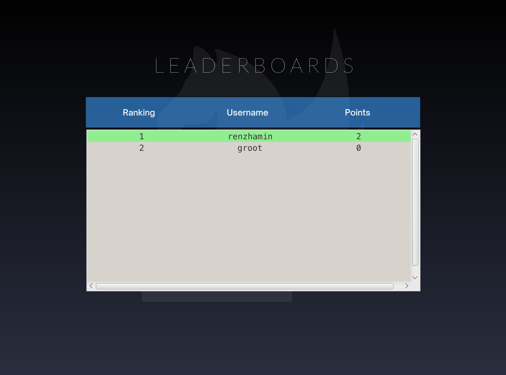
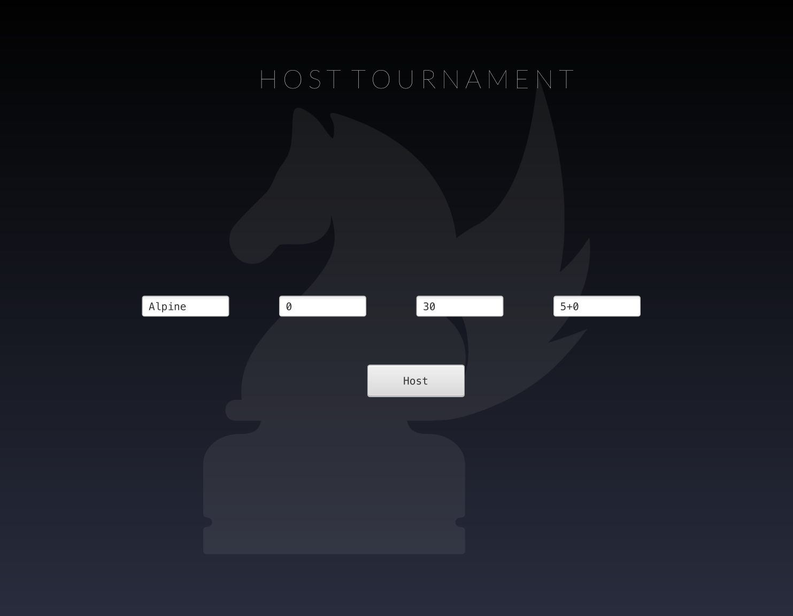
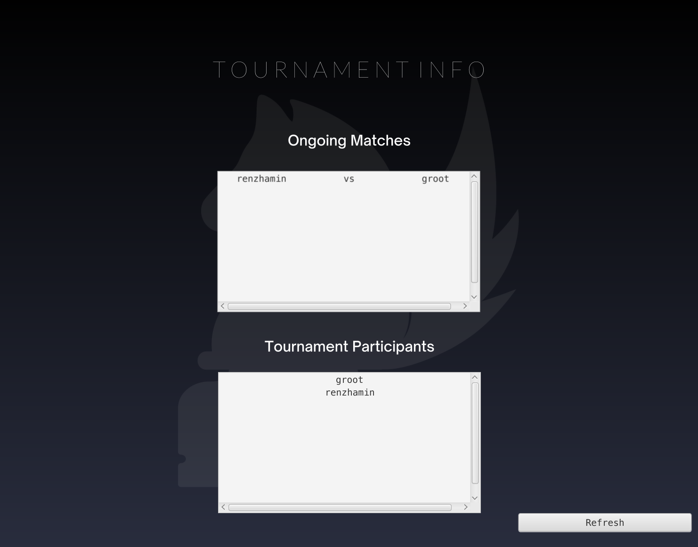

# lightchess
This is a chess game that supports playing over local network
- You can play any casual game or
- You can host a tournament and compete with other players

# Features
- Currently the open tournament format is available
- Your login password is hashed with sha256
- Your elo will be updated after playing a match
- You can check your elo, matchs won and other info in the dashboard
- You can host and play in tournaments
- While running the client you can input the ip or domain name of the server as program arguments, allowing you to play in multiple servers

# Login page

# Dashboard

# User Statistics

# Playing in the Tournament
- When you click on the tournament name, you will be registered for the tournament

- When you click ready you will be put in a queue
- You will be paired up with a player who has the closest score to your score
- As soon as there is at least one player other than you in the queue,you will be paired up

- After the game is finished you will again go into "Not Ready" state and you will be considered for another match after you hit ready
- At any time you can see the leaderboard

# Hosting Tournament
- The server has a simple UI to host tournament
- You can input tournament name, the number of minutes before the tournament will start and end

- After the tournament is hosted you can see participant list and ongoing matches

